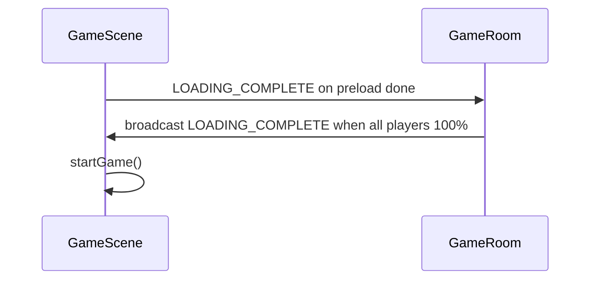

# prototype-wasd: Analysis and Implementation Plan

**Constraint:** Plan only. No files created, edited, or deleted.

---

## Part 1 — Framework verification (9 checkpoints)

### 1. Client entry point

| Item | Path |
|------|------|
| HTML shell | [`app/views/index.html`](app/views/index.html) |
| JS bundle entry | [`app/public/src/index.tsx`](app/public/src/index.tsx) |
| Bundler config | [`esbuild.js`](esbuild.js) (root) |

```9:10:app/views/index.html
    <link rel="stylesheet" type="text/css" href="index.css" />
    <script src="index.js" defer></script>
```

```34:36:esbuild.js
context({
  entryPoints: ["./app/public/src/index.tsx"],
```

```31:45:app/public/src/index.tsx
const container = document.getElementById("root")
const root = createRoot(container!)

i18n.on("initialized", () => {
  root.render(
    <Provider store={store}>
      ...
              <Route path="/game" element={<Game />} />
```

### 2. Phaser.Game creation

Primary production path: [`app/public/src/game/game-container.ts`](app/public/src/game/game-container.ts) — `initializeGame()`.

Secondary reference (minimal React mount): [`app/public/src/pages/component/debug/debug-scene.tsx`](app/public/src/pages/component/debug/debug-scene.tsx).

```287:316:app/public/src/game/game-container.ts
    // Create Phaser game
    const renderer = Number(preference("renderer") ?? Phaser.AUTO)
    const config = {
      type: renderer,
      width: 1950,
      height: 1000,
      parent: this.div,
      pixelArt: true,
      scene: GameScene,
      scale: { mode: Phaser.Scale.FIT },
      ...
    }
    this.game = new Phaser.Game(config)
    this.game.scene.start("gameScene", { room: this.room, spectate: this.spectate })
```

### 3. Main Phaser scene

[`app/public/src/game/scenes/game-scene.ts`](app/public/src/game/scenes/game-scene.ts) — class `GameScene extends Scene`, key `"gameScene"`.

```50:82:app/public/src/game/scenes/game-scene.ts
export default class GameScene extends Scene {
  ...
  constructor() {
    super({
      key: "gameScene",
      active: false
    })
  }
```

Lifecycle: `init()` → `preload()` → (no `create()`) → server-gated `startGame()` → `update()`.

### 4. Rendering engine

Phaser 4 with **WebGL or Canvas2D** (`Phaser.AUTO` / `Phaser.WEBGL`):

```4:4:app/public/src/game/game-container.ts
import Phaser from "phaser"
```

```288:291:app/public/src/game/game-container.ts
    const renderer = Number(preference("renderer") ?? Phaser.AUTO)
    const config = {
      type: renderer,
```

Tile layers and sprites use Phaser game objects (`Tilemap`, `Sprite`, `Group`) — not raw Canvas API, not Pixi at runtime.

### 5. Asset loading system

[`app/public/src/game/components/loading-manager.ts`](app/public/src/game/components/loading-manager.ts) — queues loads in constructor via `preload()`.

[`app/public/src/game/components/pokemon.ts`](app/public/src/game/components/pokemon.ts) — `loadCompressedAtlas()` for Pokémon sheets.

Town map loads:

```42:43:app/public/src/game/components/loading-manager.ts
    scene.load.image("town_tileset", "/assets/tilesets/Town/tileset.png")
    scene.load.tilemapTiledJSON("town", "/assets/tilesets/Town/town.json")
```

Pokémon atlas (MissingNo fallback):

```110:111:app/public/src/game/components/loading-manager.ts
    loadCompressedAtlas(scene, "0000")
```

Compressed atlas loader:

```1613:1704:app/public/src/game/components/pokemon.ts
export function loadCompressedAtlas(scene: Phaser.Scene, index: string): Promise<void> {
  ...
  scene.load.json(`pokemon-atlas-${index}`, `/assets/pokemons/${index}.json?v=${pkg.assetsVersion}`)
  ...
  scene.load.multiatlas(index, multiatlas, "/assets/pokemons").start()
}
```

**Asset build pipeline:** [`edit/assetpack/.assetpack.js`](edit/assetpack/.assetpack.js) → output `app/public/dist/client/assets/` (gitignored).

### 6. Map / tile system

Town rendering in [`app/public/src/game/scenes/game-scene.ts`](app/public/src/game/scenes/game-scene.ts) — `setMap("town")`:

```359:364:app/public/src/game/scenes/game-scene.ts
    if (mapName === "town") {
      this.map = this.add.tilemap("town")
      const tileset = this.map.addTilesetImage("town_tileset", "town_tileset")!
      this.map.createLayer("layer0", tileset, 0, 0)?.setScale(2, 2)
      this.map.createLayer("layer1", tileset, 0, 0)?.setScale(2, 2)
      this.map.createLayer("layer2", tileset, 0, 0)?.setScale(2, 2)
```

Source tilemap: [`app/public/src/assets/tilesets/Town/town.json`](app/public/src/assets/tilesets/Town/town.json) (in git).

Runtime PNG: `/assets/tilesets/Town/tileset.png` (referenced by `town.json`, **not in git checkout** — produced by assetpack or local art pipeline).

Dungeon maps use [`app/core/design.ts`](app/core/design.ts) + dynamic load in `GameScene.preloadMaps()` — **not needed for prototype**.

### 7. Sprite / player system

Board combat sprite: [`app/public/src/game/components/pokemon.ts`](app/public/src/game/components/pokemon.ts) — class `PokemonSprite`.

Animation registration: [`app/public/src/game/animation-manager.ts`](app/public/src/game/animation-manager.ts) — `createPokemonAnimations()`, `animatePokemon()`.

Walk animation key pattern:

```130:134:app/public/src/game/animation-manager.ts
            const key = `${index}/${shiny}/${action}/${mode}/${direction}`
            if (!this.game.anims.exists(key)) {
              this.game.anims.create({
                key: `${index}/${shiny}/${action}/${mode}/${direction}`,
```

Example key: `0000/Normal/Walk/Anim/2` (index / tint / Walk / Anim / Orientation.RIGHT).

Town avatar (click-to-move, server-driven): [`app/public/src/game/components/pokemon-avatar.ts`](app/public/src/game/components/pokemon-avatar.ts) extends `PokemonSprite` — **not suitable for WASD** (no movement keys; uses Colyseus + Matter.js via [`app/core/mini-game.ts`](app/core/mini-game.ts)).

**Important:** Main TypeScript source has **no WASD walking**. Prototype must implement movement from scratch using Phaser input APIs.

### 8. Keyboard input system

Shop/UI keys only in main game — [`app/public/src/game/scenes/game-scene.ts`](app/public/src/game/scenes/game-scene.ts) `registerKeys()`:

```223:226:app/public/src/game/scenes/game-scene.ts
  registerKeys() {
    const keybindings = preference("keybindings")
    this.input.keyboard!.removeAllListeners()
```

Emote keys in [`app/public/src/game/components/pokemon-avatar.ts`](app/public/src/game/components/pokemon-avatar.ts) `registerKeys()`.

Orientation helpers for facing direction: [`app/utils/orientation.ts`](app/utils/orientation.ts) — `OrientationVector`, `getOrientation()`.

Enum: [`app/types/enum/Game.ts`](app/types/enum/Game.ts) — `Orientation`, `PokemonActionState.WALK`.

For prototype, use standard Phaser pattern (not present in repo source):

```typescript
this.cursors = this.input.keyboard!.addKeys({ up: "W", down: "S", left: "A", right: "D" })
```

### 9. Package / build system

| Layer | Path | Notes |
|-------|------|-------|
| Root deps | [`package.json`](package.json) | `phaser`, `react`, `colyseus`, `esbuild`, `typescript` |
| Client dev | `npm run dev-client` → `node esbuild.js --dev` | Bundles `index.tsx` → `app/public/dist/client/` |
| Client prod | `npm run build-client` | Minified bundle |
| Server | `npm run build-server` → `tsc` → `app/public/dist/server/` | Colyseus server |
| Run full app | `npm run dev` / `npm start` | Client + server |
| Assets | `npm run assetpack` | Pixi AssetPack fork under `edit/assetpack/` |

Server entry: [`app/index.ts`](app/index.ts) → `listen(app)` from `@colyseus/tools`.

---

## Part 2 — Categorized repository file map (tree)

High-signal paths only; `...` = many sibling files.

```
pokemonAutoChess/
├── package.json                          # Build System
├── esbuild.js                            # Build System (client bundle)
├── tsconfig.json                         # Build System
│
├── edit/assetpack/                       # Build System (asset pipeline, Pixi AssetPack)
│   ├── .assetpack.js
│   ├── assetpack-cli-fork/
│   └── plugin-texture-packer-fork/
│
├── app/
│   ├── index.ts                          # Networking (Colyseus server boot)
│   ├── app.config.ts                     # Networking + Express static
│   │
│   ├── public/
│   │   ├── views/index.html              # UI (HTML shell)
│   │   ├── dist/client/                  # Build System output (bundled JS, assets)
│   │   └── src/
│   │       ├── index.tsx                 # UI (React entry)
│   │       ├── network.ts                # Networking (Colyseus client, Firebase auth)
│   │       ├── stores/                   # UI (Redux)
│   │       ├── pages/                    # UI
│   │       │   ├── game.tsx              # UI + GameContainer mount
│   │       │   ├── lobby.tsx             # UI + Networking
│   │       │   ├── preparation.tsx       # UI + Networking
│   │       │   └── component/
│   │       │       ├── game/             # UI (shop, meters, HUD)
│   │       │       ├── auth/             # UI (Firebase)
│   │       │       └── debug/            # UI + Rendering (DebugScene wrapper)
│   │       │
│   │       ├── game/                     # Rendering + Input + Assets (client)
│   │       │   ├── game-container.ts     # Rendering (Phaser.Game), Networking hooks
│   │       │   ├── animation-manager.ts  # Rendering (sprite anims)
│   │       │   ├── scenes/
│   │       │   │   ├── game-scene.ts     # Rendering + Input + map
│   │       │   │   ├── debug-scene.ts    # Rendering (isolated Phaser demo)
│   │       │   │   └── preloading-scene.ts
│   │       │   ├── components/
│   │       │   │   ├── pokemon.ts        # Rendering + sprite load
│   │       │   │   ├── pokemon-avatar.ts # Rendering + Input (emotes)
│   │       │   │   ├── board-manager.ts  # Rendering + Battle Logic (board)
│   │       │   │   ├── battle-manager.ts # Battle Logic
│   │       │   │   ├── loading-manager.ts# Assets
│   │       │   │   ├── minigame-manager.ts # Rendering + Networking (town avatars)
│   │       │   │   └── ...
│   │       │   └── plugins/
│   │       │
│   │       └── assets/                   # Assets (source art)
│   │           ├── pokemons/             # Pokémon atlases
│   │           ├── tilesets/Town/        # Map (town.json in git)
│   │           ├── environment/
│   │           ├── abilities{tps}/
│   │           └── ...
│   │
│   ├── rooms/                            # Networking
│   │   ├── game-room.ts                  # Loading gate, multiplayer
│   │   ├── preparation-room.ts
│   │   ├── custom-lobby-room.ts
│   │   ├── commands/                     # Battle Logic + game commands
│   │   └── states/                       # Data Models (Colyseus schema)
│   │
│   ├── core/                             # Battle Logic
│   │   ├── simulation.ts
│   │   ├── pokemon-entity.ts
│   │   ├── mini-game.ts                  # Town physics (Matter.js, server)
│   │   ├── abilities/
│   │   └── effects/
│   │
│   ├── models/                           # Data Models
│   │   ├── colyseus-models/
│   │   ├── mongo-models/
│   │   └── precomputed/
│   │
│   ├── config/                           # Data Models (game constants)
│   ├── types/                            # Data Models
│   ├── services/                         # Networking (API, cron, meta)
│   └── utils/                            # Shared (orientation, logger, ...)
│
├── gen/                                  # Build System / tooling
└── db-commands/                          # Data Models / migrations
```

---

## Part 3 — `prototype-wasd/` implementation plan

### Goal

Single-folder standalone demo: **Phaser only**, one scene, Town map, one Pokémon, WASD + camera follow. **Zero** Colyseus, Firebase, Express, React (use plain HTML unless you prefer a one-line mount).

### Recommended folder layout (to create later)

```
prototype-wasd/
├── package.json              # phaser + vite (or esbuild)
├── index.html                # <div id="game"> + module script
├── vite.config.ts            # base: './', publicDir: 'public'
├── public/
│   └── assets/               # copied or symlinked from parent build output
│       ├── tilesets/Town/
│       │   ├── town.json
│       │   └── tileset.png
│       └── pokemons/
│           ├── 0000.json     # recommended: MissingNo (used as global fallback)
│           └── 0000.png
└── src/
    ├── main.ts               # new Phaser.Game({ scene: WasdScene })
    ├── WasdScene.ts          # preload → create → update
    ├── loadPokemonAtlas.ts   # port of loadCompressedAtlas (trimmed)
    └── pokemonAnims.ts       # port walk/idle anim registration (trimmed)
```

### 1. Files/functions to copy or reference (not import from monolith)

| Purpose | Source file | What to take |
|---------|-------------|--------------|
| Town map load | [`loading-manager.ts`](app/public/src/game/components/loading-manager.ts) L42–43 | Two `load.image` / `load.tilemapTiledJSON` lines (change paths to `./assets/...`) |
| Town map draw | [`game-scene.ts`](app/public/src/game/scenes/game-scene.ts) `setMap()` L359–364 | Tilemap + 3 layers at scale 2 |
| Atlas load | [`pokemon.ts`](app/public/src/game/components/pokemon.ts) `loadCompressedAtlas()` L1613–1704 | Full function (~90 lines); drop `pkg.assetsVersion` or hardcode query string |
| Walk/idle anims | [`animation-manager.ts`](app/public/src/game/animation-manager.ts) `createPokemonAnimations()` L64–137 | Only for one index + `Normal` tint + `Walk`/`Idle` + `Anim` mode |
| Frame timings | `app/public/src/assets/pokemons/durations.json` | Extract keys `0000/Normal/Walk/Anim`, `0000/Normal/Idle/Anim`, and per-direction entries — **file is gitignored/generated**; copy from a dev machine after assetpack |
| Orientation | [`app/types/enum/Game.ts`](app/types/enum/Game.ts) `Orientation` enum | Copy 8-value enum or inline 0–7 |
| Facing from velocity | [`app/utils/orientation.ts`](app/utils/orientation.ts) `getOrientation()` | Optional; or map WASD to 4 directions only |
| Phaser boot pattern | [`debug-scene.tsx`](app/public/src/pages/component/debug/debug-scene.tsx) L55–72 | Minimal `new Phaser.Game({ parent, pixelArt, scene })` — **drop React wrapper** |

**Do not import** from `game-container.ts`, `game.tsx`, `network.ts`, `PokemonSprite`, `BoardManager`, `LoadingManager` class wholesale — dependency chains pull Colyseus, Firebase, config, Redux.

### 2. Exact assets — one map/background

| Asset | Source (after `npm run assetpack` in parent) | Runtime path in prototype |
|-------|----------------------------------------------|---------------------------|
| Tilemap JSON | `app/public/dist/client/assets/tilesets/Town/town.json` (or git [`app/public/src/assets/tilesets/Town/town.json`](app/public/src/assets/tilesets/Town/town.json)) | `public/assets/tilesets/Town/town.json` |
| Tileset PNG | `app/public/dist/client/assets/tilesets/Town/tileset.png` | `public/assets/tilesets/Town/tileset.png` |

Phaser keys: `town`, `town_tileset` (match main game).

**Prerequisite:** Run in parent repo:

```bash
npm install
npm run assetpack
```

Then copy Town folder from `app/public/dist/client/assets/tilesets/Town/` into `prototype-wasd/public/assets/tilesets/Town/`.

### 3. Exact assets — one Pokémon sprite

**Recommended: index `0000` (MissingNo)** — explicitly preloaded in main game as fallback; walk/idle durations exist in `durations.json`.

| Asset | Source | Prototype path |
|-------|--------|----------------|
| Compressed atlas JSON | `app/public/dist/client/assets/pokemons/0000.json` | `public/assets/pokemons/0000.json` |
| Atlas PNG | `app/public/dist/client/assets/pokemons/0000.png` | `public/assets/pokemons/0000.png` |

**Alternative (partial git checkout):** [`app/public/src/assets/pokemons/0532-0002.json`](app/public/src/assets/pokemons/0532-0002.json) is **uncompressed** Phaser format; PNG is **missing from git**. Would require `load.multiatlas('0532-0002', json, basePath)` and hand-authored walk frame keys — more work than `0000`.

### 4. Files/systems to ignore or omit entirely

| Category | Paths / systems |
|----------|-----------------|
| Networking | `app/index.ts`, `app/app.config.ts`, `app/rooms/**`, `app/public/src/network.ts`, `app/services/**` |
| Loading gates | `GameScene.preload()` LOADING_COMPLETE handlers; `GameRoom` L323–330, L572–589 |
| Firebase / auth | `app/public/src/pages/auth/**`, Firebase imports in `network.ts`, `game-scene.ts` init |
| React UI | `app/public/src/pages/**` (except debug-scene as reference), `stores/**`, `index.tsx` router |
| Battle / shop | `battle-manager.ts`, `board-manager.ts`, `simulation.ts`, `app/core/abilities/**`, `game-commands.ts` |
| Town multiplayer | `mini-game.ts`, `minigame-manager.ts`, `pokemon-avatar.ts`, Matter.js |
| Full LoadingManager | Loads music, weather, all atlases, portraits — replace with 3 load calls |
| Assetpack / edit | Not needed inside prototype if assets copied pre-built |

### 5. Bypass server / Firebase / Colyseus loading gates

Main game gate chain to **avoid**:



Prototype replaces with standard Phaser lifecycle:

1. `WasdScene.preload()` — queue town + pokemon only; `this.load.once('complete', () => this.scene.start(...))` **not needed** if using `create()`.
2. `WasdScene.create()` — call map setup + spawn player + `startFollow` immediately.
3. No `room.send`, no `room.onMessage`, no `authenticateUser()`, no `GameContainer`.

Reference gates **not to copy**:

```101:114:app/public/src/game/scenes/game-scene.ts
    this.load.once("complete", () => {
      if (!this.started) {
        this.room?.send(Transfer.LOADING_COMPLETE)
      }
    })
    this.room!.onMessage(Transfer.LOADING_COMPLETE, () => {
      if (!this.started) {
        this.started = true
        this.startGame()
      }
    })
```

```323:329:app/rooms/game-room.ts
    this.clock.setTimeout(() => {
      if (this.state.gameLoaded) return
      this.broadcast(Transfer.LOADING_COMPLETE)
      ...
      this.startGame()
    }, MAX_LOADING_TIME)
```

### 6. Standalone WASD movement (new code)

No source to copy — implement in `WasdScene.update()`:

```typescript
// WasdScene.ts (pseudocode for plan)
preload() {
  // town + loadCompressedAtlas(this, "0000")
}
async create() {
  // setMap town layers (from game-scene setMap)
  // await atlas; register Idle/Walk anims for "0000"
  this.player = this.add.sprite(startX, startY, "0000")
  this.player.setScale(2)
  this.physics?.add.existing(this.player) // optional: arcade physics
  this.cursors = this.input.keyboard!.addKeys({ w: "W", a: "A", s: "S", d: "D" })
  this.cameras.main.setBounds(0, 0, mapWidth * 2, mapHeight * 2)
  this.cameras.main.startFollow(this.player, true, 0.08, 0.08)
}
update(_time, delta) {
  const speed = 120 // px/sec; match main game feel (~48px cells)
  let vx = 0, vy = 0
  if (this.cursors.w.isDown) vy -= 1
  if (this.cursors.s.isDown) vy += 1
  if (this.cursors.a.isDown) vx -= 1
  if (this.cursors.d.isDown) vx += 1
  // normalize diagonal; player.x/y += velocity * delta/1000
  // pick Orientation from (vx, vy); play `0000/Normal/Walk/Anim/{dir}` or Idle
}
```

Use **Y-up sprite convention** from [`OrientationVector`](app/utils/orientation.ts) (UP = `[0,1]` increases y) — same as main game board coords.

Optional: enable Phaser Arcade Physics in config (`physics: { default: 'arcade' }`) for cleaner movement; main game uses manual positioning for board sprites.

### 7. Camera follow

Main game **does not** follow the player — only manual pan/zoom in `setupCamera()` ([`game-scene.ts`](app/public/src/game/scenes/game-scene.ts) L191–220).

Prototype should use **Phaser built-in**:

```typescript
this.cameras.main.setBounds(0, 0, mapPixelW, mapPixelH)
this.cameras.main.startFollow(this.player, true, lerpX, lerpY)
// optional: this.cameras.main.setZoom(1)
```

Bounds should match scaled tilemap size (`map.widthInPixels * 2` if layers use `setScale(2, 2)` like main game).

### 8. Run locally

**Option A — Vite (recommended for prototype isolation)**

In `prototype-wasd/` (when created):

```json
{
  "scripts": {
    "dev": "vite",
    "build": "vite build",
    "preview": "vite preview"
  },
  "dependencies": { "phaser": "^4.1.0" },
  "devDependencies": { "vite": "^6.x", "typescript": "^5.x" }
}
```

```bash
cd prototype-wasd
npm install
# ensure public/assets populated (copy from parent dist)
npm run dev
# open http://localhost:5173
```

**Option B — Parent static server**

Copy built prototype into `app/public/dist/client/prototype-wasd/` and hit `/prototype-wasd/` via existing Express — couples to main app; **avoid** per requirements.

**Option C — npx serve**

```bash
npx serve prototype-wasd/public -p 8080
# requires pre-bundled JS or use vite build first
```

**Asset prep (one-time, from repo root):**

```bash
npm run assetpack
mkdir -p prototype-wasd/public/assets/tilesets/Town
mkdir -p prototype-wasd/public/assets/pokemons
cp app/public/dist/client/assets/tilesets/Town/* prototype-wasd/public/assets/tilesets/Town/
cp app/public/dist/client/assets/pokemons/0000.* prototype-wasd/public/assets/pokemons/
# copy durations snippet or full durations.json for anim timings
```

---

## Part 4 — Risk notes

- **Assets not in git:** `tileset.png`, `0000.png/json`, `durations.json` require assetpack or an existing dev `dist/client/assets` tree.
- **Compressed vs uncompressed atlases:** Runtime loader expects compressed `{i,s,a}` JSON; built `dist` output is compressed. Git `0532-0002.json` is uncompressed — use `0000` from dist instead.
- **Scope creep:** Resist importing `PokemonSprite` (1700+ lines, Colyseus types, drag-drop, tooltips). A plain `Phaser.GameObjects.Sprite` + ported anim keys is enough.
- **React:** Omit entirely; `index.html` + `<script type="module" src="/src/main.ts">` satisfies “minimum mount.”

---

## Part 5 — Implementation order (when executing)

1. Create `prototype-wasd/` with Vite + Phaser dependency only.
2. Copy Town + `0000` assets from parent `dist` after assetpack.
3. Port `loadCompressedAtlas` + minimal anim registration for `0000`.
4. Implement `WasdScene` with town layers (from `setMap` town branch).
5. Add WASD in `update()` + `startFollow`.
6. Verify in browser with no parent server running.

No repository files modified in this planning phase.
