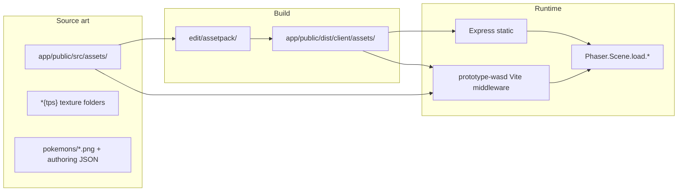

# Asset Pipeline

How art in this repository becomes files served at **`/assets/...`** and loaded by Phaser.

---

## Overview



| Stage | Tool | Output |
|-------|------|--------|
| Authoring | Tiled, texture packer folders `{tps}` | `app/public/src/assets/` |
| Build | Pixi **AssetPack** (`npm run assetpack`) | `app/public/dist/client/assets/` |
| Serve (main) | Express `static(clientSrc)` | `GET /assets/...` |
| Serve (prototype) | Vite plugin + parent paths | Same URLs |

**Pixi.js is not a runtime renderer** — only AssetPack tooling under `edit/assetpack/`.

---

## Build command

From repository root:

```bash
npm install          # postinstall → edit/assetpack npm install
npm run assetpack    # cd edit/assetpack && npm run assetpack
```

Config: [`edit/assetpack/.assetpack.js`](./edit/assetpack/.assetpack.js)

```javascript
export default {
  entry: "../../app/public/src/assets",
  output: "../../app/public/dist/client/assets",
  cache: true,
  plugins: { /* compress, json, texturePacker, compressedAtlas, ... */ }
}
```

Updates `package.json` **`assetsVersion`** via atlas indexer plugin.

`.gitignore` includes `app/public/dist/client/assets` — built blobs may be absent in a fresh clone until assetpack runs.

---

## Asset categories

### 1. Pokémon sprites (`/assets/pokemons/`)

| Aspect | Detail |
|--------|--------|
| Source | `app/public/src/assets/pokemons/{index}.png` + JSON |
| Build output | `app/public/dist/client/assets/pokemons/` |
| Index examples | `0333` (Swablu), `0000` (MissingNo), `0532-0002` (Pillar Wood) |

#### Two JSON formats

**A. Standard (authoring / some git files)**

```json
{
  "textures": [{
    "image": "0333.png",
    "frames": [{ "filename": "Normal/Idle/Anim/0/0000", ... }]
  }]
}
```

Phaser load:

```typescript
scene.load.multiatlas("0333", "/assets/pokemons/0333.json", "/assets/pokemons/")
```

**B. Compressed (runtime / after assetpack)**

```json
{ "i": "0000.png", "s": [w, h, scale], "a": { ... nested frame arrays ... } }
```

Client rebuilds multiatlas in memory — see `loadCompressedAtlas()` in:

- `app/public/src/game/components/pokemon.ts`
- `prototype-wasd/src/loadPokemonAtlas.ts`

```typescript
scene.load.json(`pokemon-atlas-${index}`, `/assets/pokemons/${index}.json?v=${assetsVersion}`)
// → traverse data.a → scene.load.multiatlas(index, multiatlas, "/assets/pokemons/`)
```

**Assetpack plugin:** `compressedAtlas` in `.assetpack.js`:

```javascript
compressedAtlas({
  path: "../../app/public/src/assets/pokemons",
  include: /\d+-?\d+/,
  outputPath: "../../app/public/dist/client/assets/pokemons"
})
```

#### Animation frame naming

Frames follow:

```
{Tint}/{Action}/{Anim|Shadow}/{Orientation}/{frame}
```

Example animation key (registered in `animation-manager.ts`):

```
0333/Normal/Walk/Anim/2
```

- **Tint:** `Normal`, `Shiny`
- **Action:** `Idle`, `Walk`, `Attack`, …
- **Orientation:** `0`–`7` (see `Orientation` enum in `app/types/enum/Game.ts`)

**Durations:** `app/public/src/assets/pokemons/durations.json` — frame timing arrays per key path.

**Main game preload fallback:**

```typescript
loadCompressedAtlas(scene, "0000")  // MissingNo — loading-manager.ts
```

---

### 2. Texture packs (`/assets/{pack}/`)

Defined in `app/public/src/assets/atlas.json`:

| Pack key | Typical name | Contents |
|----------|--------------|----------|
| `abilities{tps}` | `abilities` | Ability VFX |
| `attacks{tps}` | `attacks` | Attack VFX |
| `item{tps}` | `item` | Items |
| `status{tps}` | `status` | Status effects |
| `types{tps}` | `types` | Type icons |

Build: `texturePacker` plugin (Phaser3 exporter) + `texturePackIndexer`.

Load pattern (`loading-manager.ts`):

```typescript
scene.load.multiatlas(
  packName,
  `/assets/${pack}/${packName}.json?v=${assetsVersion}`,
  `/assets/${pack}/`
)
```

---

### 3. Tilemaps (`/assets/tilesets/`)

| Map | Source | Runtime |
|-----|--------|---------|
| Treasure Town | `tilesets/Town/town.json` + `tileset.png` | `load.tilemapTiledJSON("town", ...)` |
| Dungeons | `tilesets/{DungeonName}/` | Dynamic `preloadMaps()` in `GameScene` |

Town JSON references:

- Tileset name: `town_tileset`
- Image: `tileset.png`
- Layers: `layer0`, `layer1`, `layer2`

**Prototype** uses only Town — see [PROTOTYPE_WASD_PLAN.md](./PROTOTYPE_WASD_PLAN.md).

---

### 4. Environment (`/assets/environment/`)

`loading-manager.ts` loads rain, sand, clouds, multiatlases (`portal`, `chest`, `berry_trees`, `loading_pokeball`, etc.).

---

### 5. UI, portraits, audio

| Path | Use |
|------|-----|
| `/assets/ui/` | Board cells, arrows |
| `/assets/portraits/` | React UI portraits |
| `/assets/musics/` | Downloaded via `npm run download-music` (separate repo) |

---

## Runtime loading (main game)

**Central preloader:** [`app/public/src/game/components/loading-manager.ts`](./app/public/src/game/components/loading-manager.ts)

Called from `GameScene.preload()`:

1. Town tileset + JSON
2. Music, weather images
3. All packs from `atlas.json`
4. Environment multiatlases
5. Per-player map preload (`preloadMaps`)
6. Portraits for shop UI
7. `loadCompressedAtlas(scene, "0000")`

**Lazy per-Pokémon load:** `PokemonSprite.lazyLoadAnimations()` → `loadCompressedAtlas(scene, pokemon.index)`.

**Version query string:** `?v=${package.json assetsVersion}` busts CDN cache.

---

## Runtime loading (prototype-wasd)

| Asset | When | How |
|-------|------|-----|
| Town | `preload()` | `load.image` + `load.tilemapTiledJSON` |
| Swablu | `preload()` | `load.multiatlas("0333", ...)` |
| MissingNo | fallback async | `loadPokemonAtlas(scene, "0000")` compressed path |

Vite serves files without copying — see `prototype-wasd/vite.config.ts`.

---

## Pokémon index lookup

Species → atlas index mapping: [`app/types/enum/Pokemon.ts`](./app/types/enum/Pokemon.ts)

```typescript
[Pkm.SWABLU]: "0333"
```

Use the **index string** as Phaser texture key, not the enum name.

---

## Troubleshooting

| Symptom | Likely cause | Action |
|---------|--------------|--------|
| 404 on `/assets/pokemons/0333.png` | Assetpack not run; PNG gitignored | `npm run assetpack` or verify `src/assets/pokemons/` |
| JSON loads, sprite never appears | Compressed JSON without PNG | Check paired `.png`; watch console `loaderror` |
| Atlas timeout 8–12s | Loader busy; wrong `filecomplete` event | `ensureLoaderIdle`; use `filecomplete-multiatlas-{key}` |
| Town renders blank | `tileset.png` missing | Verify `Town/tileset.png` exists |
| Wrong format loader | Standard vs compressed | `fetch` JSON: `"i" in data` → compressed branch |

---

## File path cheat sheet

| Asset | Typical source | Built output |
|-------|----------------|--------------|
| Swablu | `src/assets/pokemons/0333.{json,png}` | `dist/client/assets/pokemons/0333.*` |
| Town map | `src/assets/tilesets/Town/town.json` | Same path under dist |
| Town tiles | `src/assets/tilesets/Town/tileset.png` | Same |
| Abilities atlas | `src/assets/abilities{tps}/` | `dist/client/assets/abilities/` |
| Atlas manifest | `src/assets/atlas.json` | Version bumped on pack build |

---

## Related docs

- [STARTUP_FLOW.md](./STARTUP_FLOW.md) — when LoadingManager runs
- [REPO_MAP.md](./REPO_MAP.md) — where files live
- [PROTOTYPE_WASD_PLAN.md](./PROTOTYPE_WASD_PLAN.md) — minimal asset subset for demo
