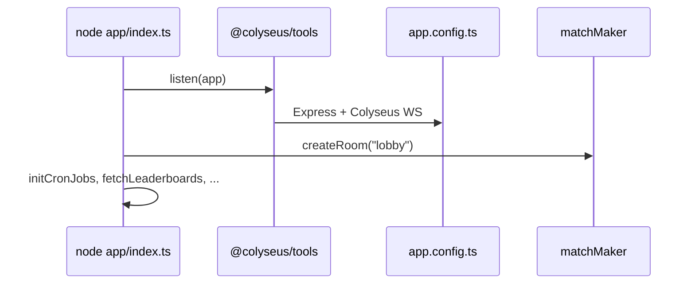
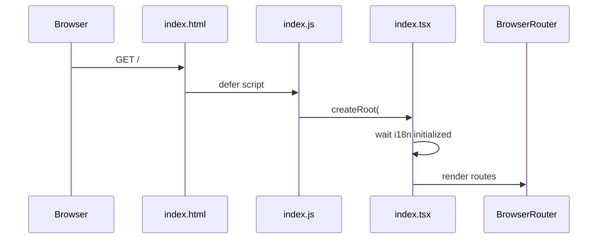
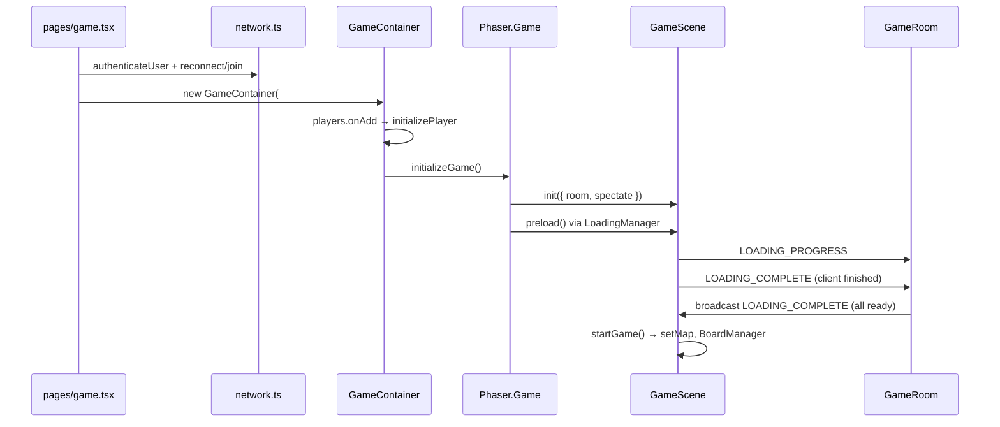
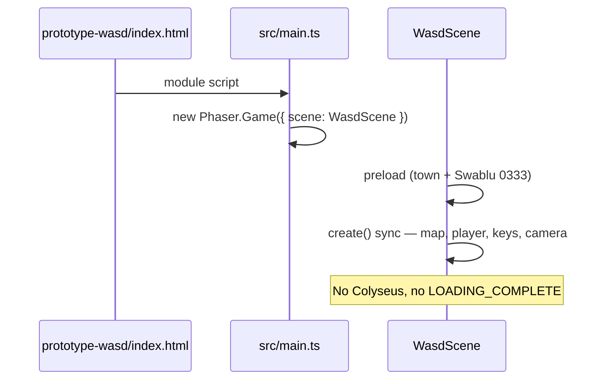

# Startup Flow

How the **main game** boots from HTTP request to first meaningful Phaser frame, and how **`prototype-wasd`** differs.

---

## Main application — two entry points

| Runtime | Entry file | Role |
|---------|------------|------|
| **Server** | `app/index.ts` | Colyseus + Express |
| **Client** | `app/public/src/index.tsx` | React SPA (bundled by `esbuild.js`) |

There is no single `main()` for the browser; the client starts when `index.js` loads from `app/views/index.html`.

---

## Server startup (`app/index.ts`)



### Steps

1. **`Encoder.BUFFER_SIZE = 512 * 1024`** — larger Colyseus schema buffer.
2. **`listen(app)`** — starts HTTP/WebSocket server (`app/app.config.ts`).
3. **`matchMaker.createRoom("lobby", {})`** — always-on lobby room.
4. **PM2 path** — multi-instance on ports `2569 + instance`.
5. **Background jobs** — leaderboards, meta, Twitch, sprite-gap scanner intervals.

### Room registration (`app/app.config.ts`)

```typescript
export const server = defineServer({
  rooms: {
    "after-game": defineRoom(AfterGameRoom),
    lobby: defineRoom(CustomLobbyRoom),
    preparation: defineRoom(PreparationRoom).enableRealtimeListing(),
    game: defineRoom(GameRoom).enableRealtimeListing()
  }
})
```

Static files: `express.static` → `app/public/dist/client/` (see `clientSrc` in config).

---

## Client startup — page load to React



### Files

| Step | Path |
|------|------|
| HTML | `app/views/index.html` — `<div id="root">`, `<script src="index.js">` |
| Bundle | `esbuild.js` entry `./app/public/src/index.tsx` → `app/public/dist/client/` |
| Mount | `createRoot(container).render(<Provider><Routes>…`) |

### Routes (initial paint is React, not Phaser)

| Path | Component |
|------|-----------|
| `/`, `/auth` | `Auth` |
| `/lobby` | `Lobby` |
| `/preparation` | `Preparation` |
| `/game` | `Game` ← Phaser mounts here |
| `/after` | `AfterGame` |

---

## Client startup — `/game` route to Phaser



### 1. Join match (`app/public/src/pages/game.tsx`)

- `authenticateUser()` — Firebase (`network.ts`).
- `client.reconnect(reconnectionToken)` or join flow.
- `joinGame(room)` stores room in `rooms.game`.

### 2. Mount Phaser (`app/public/src/game/game-container.ts`)

Triggered when `#game` ref exists and player is in room state:

```typescript
// initializeGame() — excerpt
this.game = new Phaser.Game({
  type: renderer,           // Phaser.AUTO / WEBGL / CANVAS
  width: 1950,
  height: 1000,
  parent: this.div,
  pixelArt: true,
  scene: GameScene,
  scale: { mode: Phaser.Scale.FIT },
  plugins: { global: [MoveToPlugin] }
})
this.game.scene.start("gameScene", { room, spectate })
```

### 3. Scene lifecycle (`app/public/src/game/scenes/game-scene.ts`)

| Phase | Method | What happens |
|-------|--------|----------------|
| Init | `init(data)` | Store `room`, `uid` from Firebase |
| Preload | `preload()` | `LoadingManager` queues tilesets, atlases, music, maps |
| *(no `create()`)* | — | Waits for server |
| Start | `startGame()` | After `LOADING_COMPLETE` message |

**Preload completion (client):**

```typescript
this.load.once("complete", () => {
  this.room?.send(Transfer.LOADING_COMPLETE)
})
```

### 4. Server loading gate (`app/rooms/game-room.ts`)

- Each client sends `Transfer.LOADING_COMPLETE` when preload finishes.
- When **all** players have `loadingProgress === 100`, server **broadcasts** `LOADING_COMPLETE` and calls server `startGame()`.
- **Timeout:** `MAX_LOADING_TIME` (~3 min) forces start anyway.

```typescript
this.clock.setTimeout(() => {
  this.broadcast(Transfer.LOADING_COMPLETE)
  this.startGame()
}, MAX_LOADING_TIME)
```

### 5. First meaningful Phaser frame

Inside `GameScene.startGame()`:

1. **`setMap(player.map)`** — creates tilemap layers (first visible map).
2. **`BoardManager`** — `renderBoard()`, Pokémon sprites on grid.
3. **`MinigameManager` / `BattleManager`** — phase-dependent.
4. React overlay: `game.tsx` sets `loaded` true on `LOADING_COMPLETE` → shows shop, sidebar.

**Town map branch (`mapName === "town"`):**

```typescript
this.map = this.add.tilemap("town")
const tileset = this.map.addTilesetImage("town_tileset", "town_tileset")!
this.map.createLayer("layer0", tileset, 0, 0)?.setScale(2, 2)
// layer1, layer2 ...
```

---

## prototype-wasd startup (simplified)



| Step | File | Notes |
|------|------|-------|
| HTML | `prototype-wasd/index.html` | `#game` only |
| Boot | `prototype-wasd/src/main.ts` | `Phaser.Scale.RESIZE` |
| Assets | `vite.config.ts` | `/assets` → parent `src/assets` or `dist/client/assets` |
| Scene | `WasdScene.ts` | `preload` → `create` immediately |

**First frame:** `create()` draws town (or fallback rectangle), places Swablu/placeholder at map center, `cameras.main.startFollow(player)`.

---

## Rendering engine detail

| Setting | Main game | Prototype |
|---------|-----------|-----------|
| API | Phaser 4 | Phaser 4 |
| Backend | `Phaser.AUTO` → WebGL or Canvas2D | Same |
| Pixel art | `pixelArt: true` | `pixelArt: true` |
| DOM overlay | `dom.createContainer: true` | None |

Phaser owns the `<canvas>`; React renders HTML **around** `#game` in the main app.

---

## What is *not* in the startup path

| System | Why absent from first frame |
|--------|----------------------------|
| Electron | Web-only deployment |
| Pixi | Build-time AssetPack only |
| MongoDB | Not needed until API/auth routes |
| Battle simulation | Starts after `startGame()` phase logic |

---

## Debugging checklist

| Symptom | Check |
|---------|-------|
| Blank `/game` | Colyseus connected? `GameContainer` initialized? |
| Stuck loading overlay | `LOADING_COMPLETE` broadcast? Console network WS |
| No map tiles | `/assets/tilesets/...` 404? Run `npm run assetpack` |
| No Pokémon sprites | `/assets/pokemons/{index}.json` + `.png` |
| Prototype black screen | Console `isDown` errors? Keyboard keys case |

See [ASSET_PIPELINE.md](./ASSET_PIPELINE.md) for asset paths.
